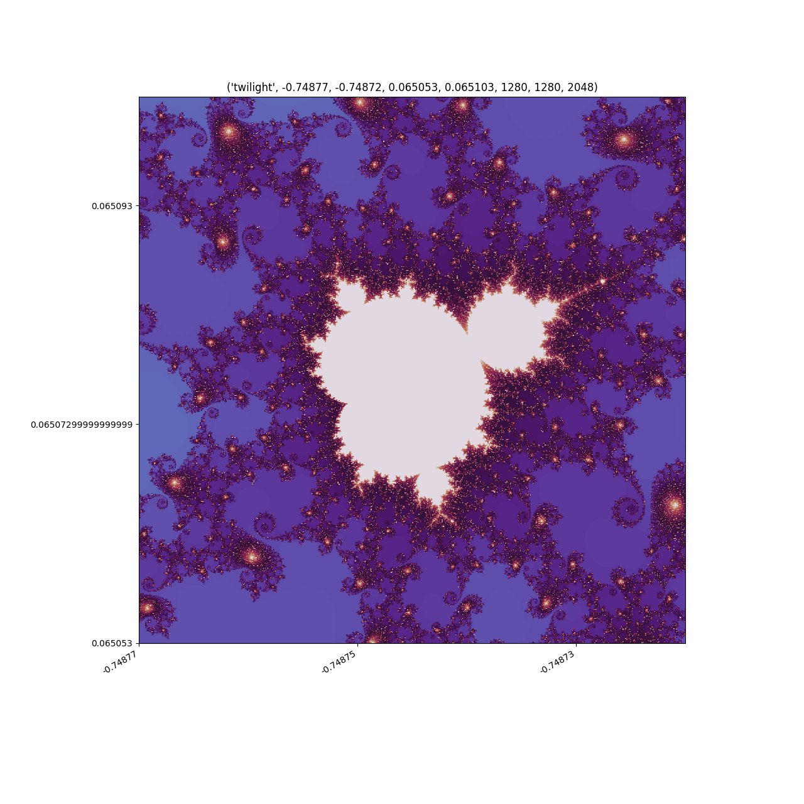
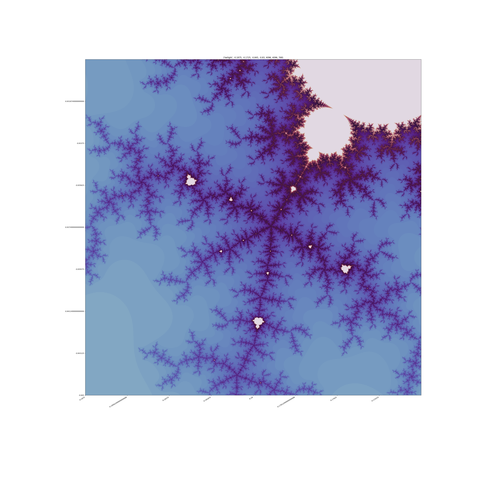
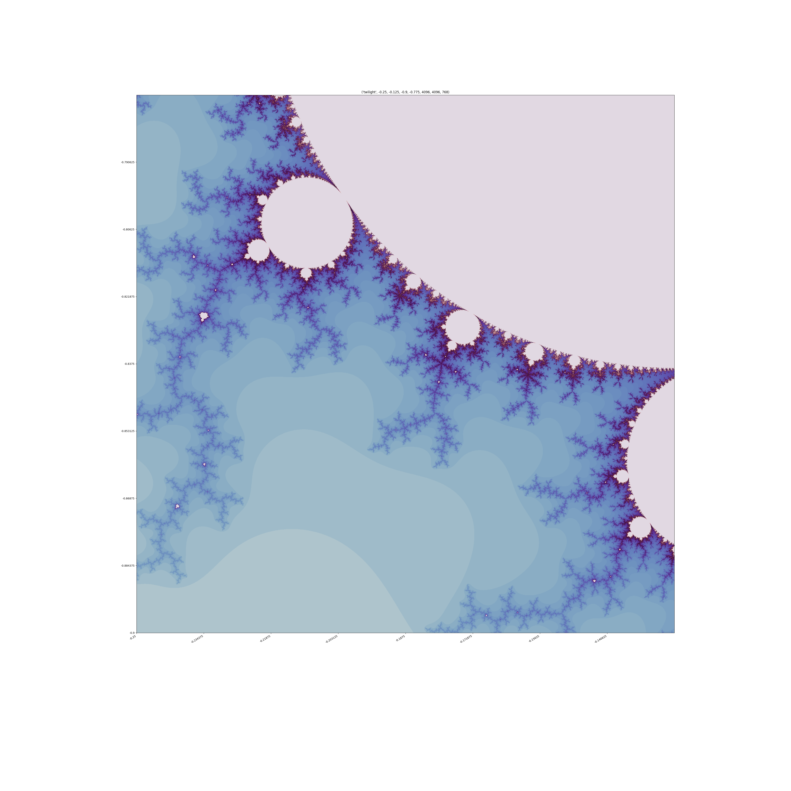
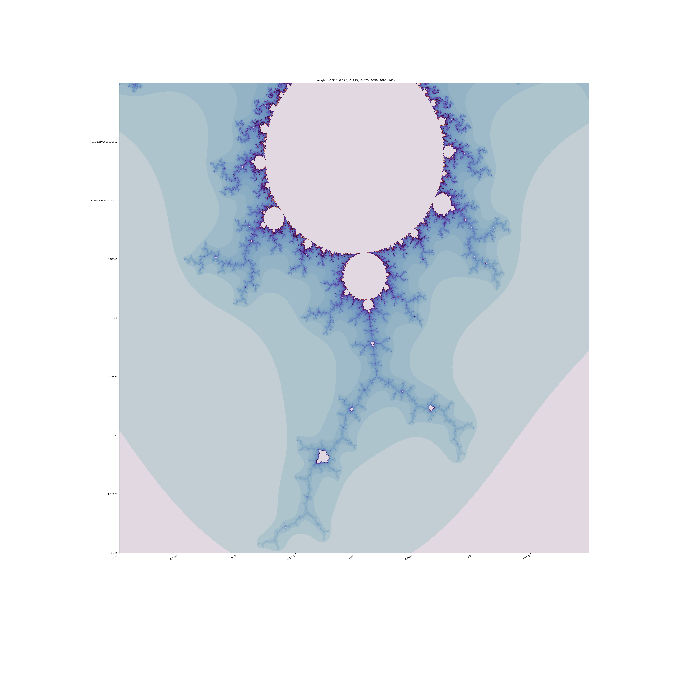
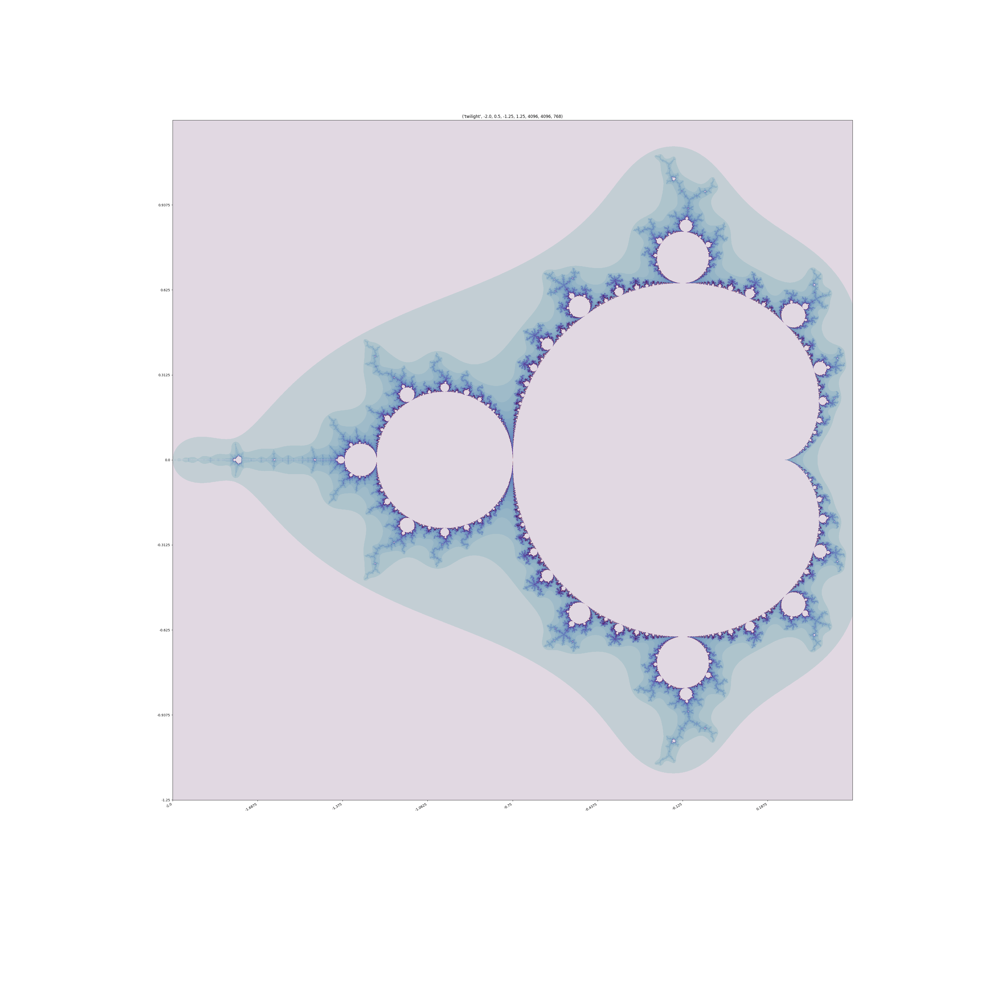

# StormyRoseSplice
  - Mandelbrot plot play
  - The output array can be plotted in Pillow, and saved to any image type supported

## Program help:
  - --cpu                 : Run the program on CPU
  - --gpu                 : Run the program on GPU
  - --platform [PLATFORM] : Select which platform the device is on
  - --device [DEVICE]     : Select the device to run on

## Inspiration:
  - Prompted by Reddit post by Adam Reed and his [pastebin code](https://pastebin.com/mr8stzKx), which inspired a wave of nostalgia for early 90's Mandelbrot fever and my first ever pass at doing this in QBasic (After reading James Gleick's 'Chaos') Memories of the awesome fractint https://en.wikipedia.org/wiki/Fractint
  - This implements two methods from JeanFrancoisPuget's matrix. Generating the set by iterating through the coordinate space which is speeded up immensely using the jit decorator from numba, or by passing arrays to an OpenCL kernel to run on gpu

## Interesting coordinate sets:
  - These can be filled into the script in the same way as the defaults
  - Top level:   `xmin, xmax, ymin, ymax = -2.0, 0.5, -1.25, 1.25`
  - Test Zoom 1: `xmin, xmax, ymin, ymax = -0.375, 0.125, -1.125, -0.675`
  - Test Zoom 2: `xmin, xmax, ymin, ymax = -0.25, -0.125, -0.9, -0.775`
  - Test Zoom 3: `xmin, xmax, ymin, ymax = -0.1875, -0.1725, -0.845, -0.830`

## Examples:

